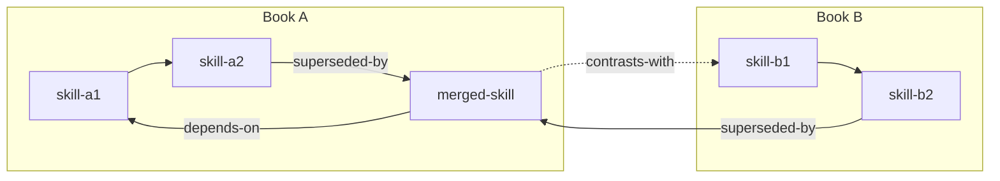

# Phase 3 — Cross-Book Zettelkasten

## Goal

Integrate each merged skill into both source books' skill graphs so the merged skill
is reachable from either origin, and source skills point to their successor.

## Three Updates Required

### 1. Mark Superseded Source Skills

Source skills are book2skill outputs; they must stay `exegesis lint`-clean. Record links
in the source SKILL.md's **body `## Related skills` section only** — never add a
`related_skills` frontmatter key, and never write a `[...](../../…/SKILL.md)` file
link (it escapes the skill directory and fails `exegesis lint`). Reference the merged
skill by backticked slug text:

```markdown
## Related skills

- superseded-by: `<merged-skill-slug>` — consolidated with `<source-skill-b>` from
  *<Book B>*. Use the merged skill for new work; this file is retained for audit.
```

Do NOT delete the source skills. They remain as the audit trail of what was merged.

### 2. Link Merged Skill into Both Graphs

In the merged SKILL.md's body `## Related Skills` section (not frontmatter), add:

- `depends-on`: any skills from either source book that the merged skill builds on
- `contrasts-with`: skills from either source book that the merged skill is often
  confused with (especially the dissolved surface-resemblance pairs from Phase 0)
- `composes-with`: complementary pairs identified in Phase 0

```markdown
## Related Skills

- depends-on: `<slug-a>/<dependency-skill>`
- contrasts-with: `<slug-b>/<contrast-skill>`
- composes-with: `<slug-a>/<complement-skill>`
```

### 3. Generate INDEX.md

Write `books/merged/<merge-slug>/INDEX.md` using `templates/INDEX.md.template`.

The cross-book INDEX must include:

**Provenance table**:

| Merged skill    | Source A             | Source B             | Merge type  |
| --------------- | -------------------- | -------------------- | ----------- |
| `<merged-slug>` | `<book-a>/<skill-a>` | `<book-b>/<skill-b>` | convergence |

**Cross-book Mermaid graph**:
Show the merged skill's position in both source graphs simultaneously:



**Dissolved pairs section**:
List all pairs that were detected in Phase 0 but not merged, with their disposition:

- Surface resemblance: `<skill-a>` vs `<skill-b>` → `contrasts-with` link added
- Complementary: `<skill-a>` vs `<skill-b>` → `composes-with` link added
- V4 failed: `<skill-a>` vs `<skill-b>` → both retained, `composes-with` link added

______________________________________________________________________

## How to Add Links to Non-Merged Pairs

For every pair that was dissolved (surface resemblance, complementary, V4 failed),
you must add Zettelkasten links to both source SKILL.md files. Here is the exact
procedure:

### Step 1 — Open the First Source Skill's SKILL.md

In its body `## Related Skills` section (not frontmatter), add a bullet referencing
the other skill by backticked slug text (no `../` file links):

```markdown
<!-- surface-resemblance pair: -->
- contrasts-with: `<slug-b>/<skill-b>` — detected as surface resemblance in the
  merge-skills run on {{DATE}}. Both address [shared topic] via different mechanisms:
  this skill uses [mechanism A]; `<skill-b>` uses [mechanism B].

<!-- complementary pair: -->
- composes-with: `<slug-b>/<skill-b>` — identified as complementary on {{DATE}}. Use
  this skill for [context A]; chain with `<skill-b>` when [combined context].

<!-- V4-failed pair: -->
- composes-with: `<slug-b>/<skill-b>` — merge attempted and dissolved (v4-failed) on
  {{DATE}}. Both address [shared principle] independently; neither supersedes the other.
```

### Step 2 — Repeat for the Second Source Skill's SKILL.md

Add the mirror link in `books/<slug-b>/<skill-b>/SKILL.md` pointing back to
`books/<slug-a>/<skill-a>` with the same relation and a matching note.

### Step 3 — Record in INDEX.md Dissolved Pairs Table

Add a row to the Dissolved pairs table in `books/merged/<merge-slug>/INDEX.md`.

### Step 4 — Update Source Books' INDEX.md Files

In each source book's `books/<slug-a>/INDEX.md` and `books/<slug-b>/INDEX.md`,
add a note in the Related Skills Graph section showing the new cross-book edge:

- For `contrasts-with`: dashed edge between the two skills in the Mermaid graph
- For `composes-with`: dotted edge labelled "composes-with"

**Completion check**: For each dissolved pair, verify that both source SKILL.md
files have been updated and that the INDEX.md dissolved pairs table has a new row.
Count expected updates: 2 SKILL.md edits + 1 INDEX.md row per dissolved pair.
